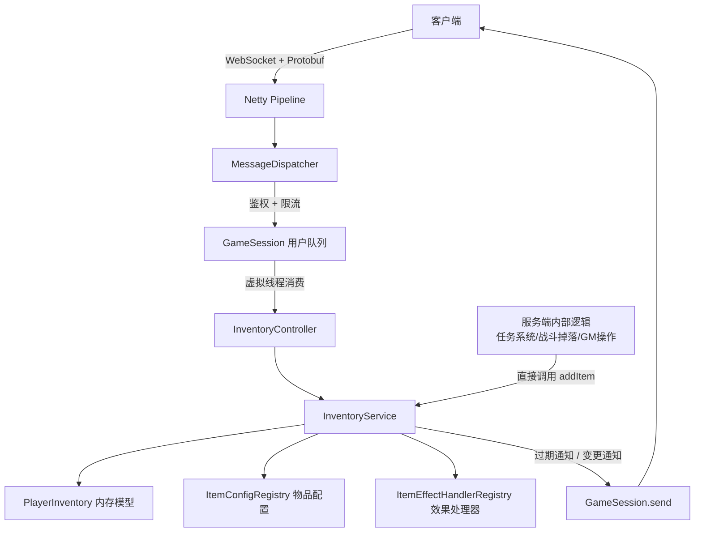
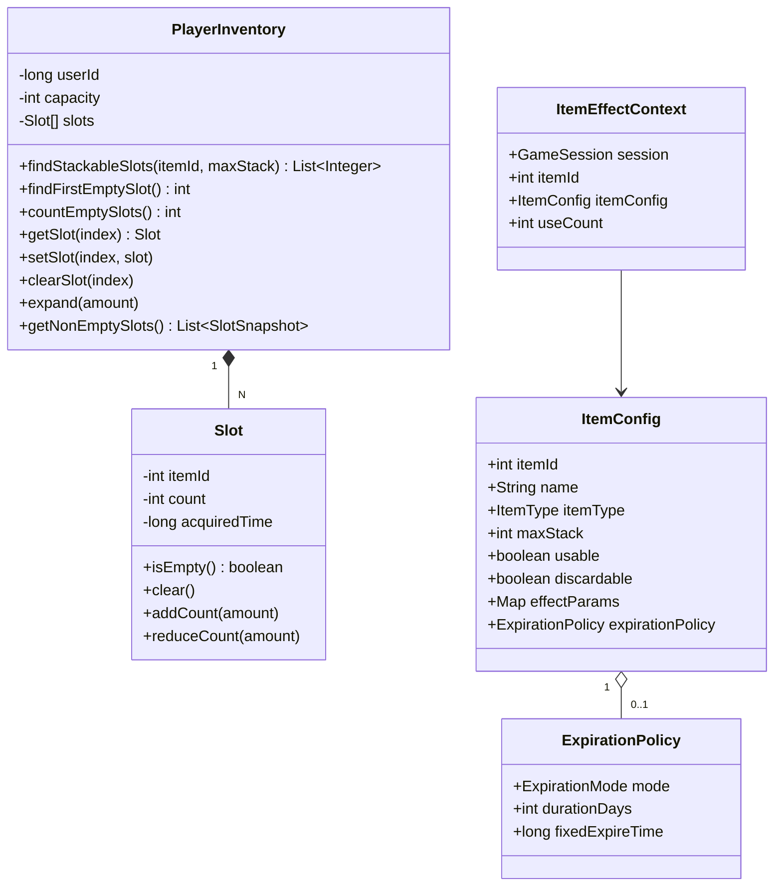
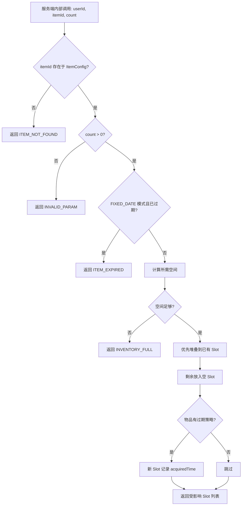
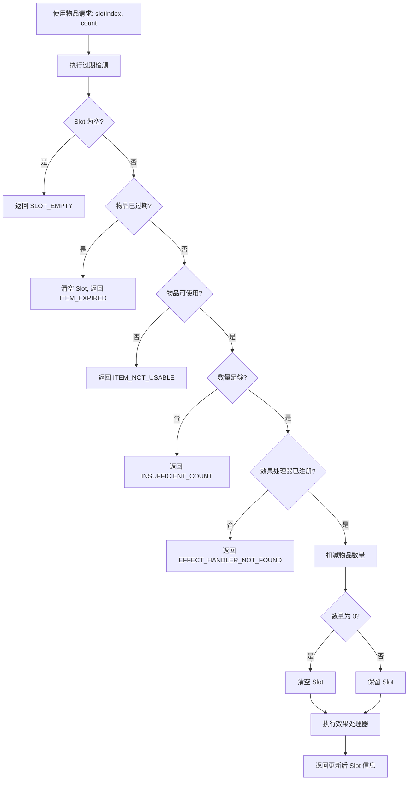
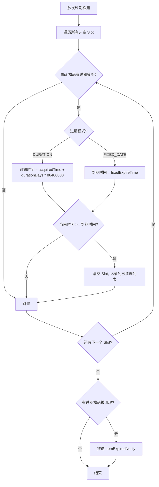

# 技术设计文档：游戏背包模块（Game Inventory）

## 概述

游戏背包模块为 Rainnov Framework Server 新增物品管理能力。模块遵循框架现有的注解驱动消息路由模式（`@MsgController` + `@MsgMapping`），通过 Protobuf 定义请求/响应消息，按用户维度（`GroupType.USER`）串行处理所有背包操作，保证单玩家物品数据的一致性。

核心功能包括：查询背包、使用物品（触发效果处理器）、丢弃物品、整理背包（合并+紧凑）、交换格子、背包扩容，以及物品过期检测与清理。添加物品为服务端内部操作（由任务系统、战斗掉落、GM 操作等直接调用 InventoryService），不暴露为客户端消息接口。

模块消息号范围使用 `msg-modules.properties` 中已预留的 `5000=RESERVE` 段（重命名为 `INVENTORY`），分配 5001~5099。

## 架构

### 整体架构图



### 分层设计

| 层级 | 组件 | 职责 |
|------|------|------|
| 协议层 | `inventory.proto` | 定义请求/响应消息和公共子消息 |
| 控制器层 | `InventoryController` | `@MsgController`，接收消息并委托给 Service |
| 服务层 | `InventoryService` | 核心业务逻辑：增删改查、过期检测、效果触发 |
| 数据层 | `PlayerInventory` | 单玩家背包内存模型（Slot 数组） |
| 配置层 | `ItemConfig` / `ItemConfigRegistry` | 物品静态配置（堆叠上限、类型、过期策略等） |
| 效果层 | `ItemEffectHandler` / `ItemEffectHandlerRegistry` | 按 ItemType 注册的效果处理器 |

### 设计决策

1. **内存模型优先**：`PlayerInventory` 为纯内存数据结构，不直接依赖数据库。持久化由上层（未来需求）负责，本模块专注于背包逻辑的正确性。
2. **按用户串行**：所有背包操作使用 `GroupType.USER`（默认值），由框架保证同一玩家的消息串行处理，无需额外加锁。
3. **效果处理器策略模式**：通过 `ItemEffectHandler` 接口 + Spring Bean 自动扫描，实现物品效果的开闭原则扩展。
4. **过期检测惰性触发**：不使用定时任务，而是在查询/使用/丢弃/整理操作前惰性执行过期检测，降低系统复杂度。
5. **消息号分配**：使用 5000 段（原 RESERVE），在 `msg-modules.properties` 中将 `5000=RESERVE` 改为 `5000=INVENTORY`。

## 组件与接口

### 1. InventoryController

```java
@MsgController
public class InventoryController {

    private final InventoryService inventoryService;

    // 查询背包 — msgId=5001
    @MsgMapping(MsgId.INVENTORY.QUERY_INVENTORY_REQ)
    public C5002_QueryInventoryResp queryInventory(GameSession session, C5001_QueryInventoryReq req);

    // 使用物品 — msgId=5005
    @MsgMapping(MsgId.INVENTORY.USE_ITEM_REQ)
    public C5006_UseItemResp useItem(GameSession session, C5005_UseItemReq req);

    // 丢弃物品 — msgId=5007
    @MsgMapping(MsgId.INVENTORY.DISCARD_ITEM_REQ)
    public C5008_DiscardItemResp discardItem(GameSession session, C5007_DiscardItemReq req);

    // 整理背包 — msgId=5009
    @MsgMapping(MsgId.INVENTORY.SORT_INVENTORY_REQ)
    public C5010_SortInventoryResp sortInventory(GameSession session, C5009_SortInventoryReq req);

    // 交换格子 — msgId=5011
    @MsgMapping(MsgId.INVENTORY.SWAP_SLOT_REQ)
    public C5012_SwapSlotResp swapSlot(GameSession session, C5011_SwapSlotReq req);

    // 扩容背包 — msgId=5013
    @MsgMapping(MsgId.INVENTORY.EXPAND_CAPACITY_REQ)
    public C5014_ExpandCapacityResp expandCapacity(GameSession session, C5013_ExpandCapacityReq req);
}
```

### 2. InventoryService

```java
@Component
public class InventoryService {

    private final ItemConfigRegistry itemConfigRegistry;
    private final ItemEffectHandlerRegistry effectHandlerRegistry;

    // 玩家背包存储：userId → PlayerInventory
    private final ConcurrentHashMap<Long, PlayerInventory> inventories;

    /** 获取或创建玩家背包 */
    public PlayerInventory getOrCreateInventory(long userId);

    /** 查询背包（先执行过期检测） */
    public QueryResult queryInventory(GameSession session);

    /** 添加物品（堆叠优先 → 空格子），纯内部方法，供其他服务端模块直接调用 */
    public AddResult addItem(long userId, int itemId, int count);

    /** 使用物品（过期检测 → 校验 → 扣减 → 触发效果） */
    public UseResult useItem(GameSession session, int slotIndex, int count);

    /** 丢弃物品（过期检测 → 校验 → 扣减） */
    public DiscardResult discardItem(GameSession session, int slotIndex, int count);

    /** 整理背包（过期检测 → 合并堆叠 → 紧凑排列） */
    public SortResult sortInventory(GameSession session);

    /** 交换格子 */
    public SwapResult swapSlots(GameSession session, int sourceIndex, int targetIndex);

    /** 扩容背包 */
    public ExpandResult expandCapacity(GameSession session, int amount);

    /** 过期检测：遍历所有 Slot，清理过期物品，返回被清理的 Slot 列表 */
    List<SlotSnapshot> cleanExpiredItems(GameSession session, PlayerInventory inventory);

    /** 服务端主动添加物品并推送通知（GM/系统发放） */
    public void addItemAndNotify(GameSession session, int itemId, int count);
}
```

### 3. PlayerInventory

```java
public class PlayerInventory {

    private final long userId;
    private int capacity;
    private final Slot[] slots;  // 固定大小数组，按 capacity 初始化

    /** 查找所有包含指定 itemId 且未满堆叠的 Slot 索引 */
    public List<Integer> findStackableSlots(int itemId, int maxStack);

    /** 查找第一个空 Slot 索引，无空位返回 -1 */
    public int findFirstEmptySlot();

    /** 计算可用空 Slot 数量 */
    public int countEmptySlots();

    /** 获取指定索引的 Slot */
    public Slot getSlot(int index);

    /** 设置指定索引的 Slot */
    public void setSlot(int index, Slot slot);

    /** 清空指定索引的 Slot */
    public void clearSlot(int index);

    /** 扩容 */
    public void expand(int amount);

    /** 获取所有非空 Slot 的快照 */
    public List<SlotSnapshot> getNonEmptySlots();
}
```

### 4. Slot

```java
public class Slot {
    private int itemId;
    private int count;
    private long acquiredTime;  // 物品获得时间戳，用于 DURATION 过期模式

    public boolean isEmpty();
    public void clear();
    public void addCount(int amount);
    public void reduceCount(int amount);
}
```

### 5. ItemConfig

```java
public record ItemConfig(
    int itemId,
    String name,
    ItemType itemType,
    int maxStack,
    boolean usable,
    boolean discardable,
    Map<String, String> effectParams,
    ExpirationPolicy expirationPolicy  // nullable，null 表示永不过期
) {}
```

### 6. ExpirationPolicy

```java
public record ExpirationPolicy(
    ExpirationMode mode,
    int durationDays,       // DURATION 模式：过期天数
    long fixedExpireTime    // FIXED_DATE 模式：固定到期时间戳
) {}

public enum ExpirationMode {
    DURATION,
    FIXED_DATE
}
```

### 7. ItemType 枚举

```java
public enum ItemType {
    HEALING,
    BUFF,
    MATERIAL,
    CURRENCY,
    EQUIPMENT,
    CONSUMABLE
    // 可扩展
}
```

### 8. ItemConfigRegistry

```java
@Component
public class ItemConfigRegistry {

    private final Map<Integer, ItemConfig> configs = new HashMap<>();

    /** 注册物品配置 */
    public void register(ItemConfig config);

    /** 根据 itemId 查找配置，不存在返回 null */
    public ItemConfig getConfig(int itemId);

    /** 启动时校验：DURATION 模式过期天数 <= 0 记录警告日志 */
    public void validateConfigs();
}
```

### 9. ItemEffectHandler 接口

```java
public interface ItemEffectHandler {

    /** 声明处理的物品类型 */
    ItemType getItemType();

    /** 执行物品效果 */
    void handle(ItemEffectContext context);
}
```

### 10. ItemEffectContext

```java
public record ItemEffectContext(
    GameSession session,
    int itemId,
    ItemConfig itemConfig,
    int useCount
) {}
```

### 11. ItemEffectHandlerRegistry

```java
@Component
public class ItemEffectHandlerRegistry implements InitializingBean {

    private final List<ItemEffectHandler> handlers;  // Spring 自动注入
    private final Map<ItemType, ItemEffectHandler> handlerMap = new EnumMap<>(ItemType.class);

    @Override
    public void afterPropertiesSet() {
        // 扫描所有 Handler，按 ItemType 建立映射
        // 同一 ItemType 注册多个 Handler 时抛出 IllegalStateException
    }

    /** 根据 ItemType 查找 Handler，不存在返回 null */
    public ItemEffectHandler getHandler(ItemType itemType);
}
```

### 12. 错误码定义

```java
public final class InventoryErrorCode {
    public static final int SUCCESS = 0;
    public static final int INVENTORY_FULL = 5001;
    public static final int ITEM_NOT_FOUND = 5002;       // itemId 在配置中不存在
    public static final int INVALID_PARAM = 5003;         // 数量 <= 0
    public static final int SLOT_EMPTY = 5004;            // 指定格子为空
    public static final int INSUFFICIENT_COUNT = 5005;    // 数量不足
    public static final int ITEM_NOT_USABLE = 5006;       // 物品不可使用
    public static final int EFFECT_HANDLER_NOT_FOUND = 5007; // 效果处理器未注册
    public static final int ITEM_NOT_DISCARDABLE = 5008;  // 物品不可丢弃
    public static final int SLOT_INDEX_OUT_OF_RANGE = 5009; // 格子索引越界
    public static final int CAPACITY_LIMIT_REACHED = 5010;  // 容量已达上限
    public static final int ITEM_EXPIRED = 5011;            // 物品已过期
}
```


## 数据模型

### 内存数据结构



### Protobuf 消息定义

文件路径：`src/main/proto/inventory.proto`

消息号分配（5001~5016，5003/5004 已释放）：

| 消息号 | 消息名 | 用途 |
|--------|--------|------|
| 5001 | C5001_QueryInventoryReq | 查询背包请求 |
| 5002 | C5002_QueryInventoryResp | 查询背包响应 |
| 5005 | C5005_UseItemReq | 使用物品请求 |
| 5006 | C5006_UseItemResp | 使用物品响应 |
| 5007 | C5007_DiscardItemReq | 丢弃物品请求 |
| 5008 | C5008_DiscardItemResp | 丢弃物品响应 |
| 5009 | C5009_SortInventoryReq | 整理背包请求 |
| 5010 | C5010_SortInventoryResp | 整理背包响应 |
| 5011 | C5011_SwapSlotReq | 交换格子请求 |
| 5012 | C5012_SwapSlotResp | 交换格子响应 |
| 5013 | C5013_ExpandCapacityReq | 扩容背包请求 |
| 5014 | C5014_ExpandCapacityResp | 扩容背包响应 |
| 5015 | C5015_InventoryChangeNotify | 物品变更通知（服务端推送） |
| 5016 | C5016_ItemExpiredNotify | 物品过期通知（服务端推送） |

> 注：5003/5004 消息号已释放（添加物品为服务端内部操作，不定义客户端消息）。

```protobuf
syntax = "proto3";
package com.rainnov.framework.proto;

option java_package = "com.rainnov.framework.proto";
option java_outer_classname = "InventoryProto";

// 公共子消息：背包格子信息
message InventorySlot {
  int32 slot_index = 1;
  int32 item_id    = 2;
  int32 count      = 3;
  int64 expire_time = 4;  // 可选，仅当物品配置了过期策略时填充，0 表示永不过期
}

// 查询背包
message C5001_QueryInventoryReq {}
message C5002_QueryInventoryResp {
  repeated InventorySlot slots = 1;
  int32 capacity = 2;
}

// 使用物品
message C5005_UseItemReq {
  int32 slot_index = 1;
  int32 count      = 2;
}
message C5006_UseItemResp {
  InventorySlot updated_slot = 1;  // 更新后的格子信息，若清空则 count=0
}

// 丢弃物品
message C5007_DiscardItemReq {
  int32 slot_index = 1;
  int32 count      = 2;
}
message C5008_DiscardItemResp {
  InventorySlot updated_slot = 1;
}

// 整理背包
message C5009_SortInventoryReq {}
message C5010_SortInventoryResp {
  repeated InventorySlot slots = 1;
  int32 capacity = 2;
}

// 交换格子
message C5011_SwapSlotReq {
  int32 source_slot_index = 1;
  int32 target_slot_index = 2;
}
message C5012_SwapSlotResp {
  InventorySlot source_slot = 1;
  InventorySlot target_slot = 2;
}

// 扩容背包
message C5013_ExpandCapacityReq {
  int32 amount = 1;
}
message C5014_ExpandCapacityResp {
  int32 new_capacity = 1;
}

// 物品变更通知（服务端主动推送）
message C5015_InventoryChangeNotify {
  repeated InventorySlot affected_slots = 1;
}

// 物品过期通知（服务端主动推送）
message C5016_ItemExpiredNotify {
  repeated InventorySlot expired_slots = 1;
}
```

### 关键业务流程

#### 添加物品流程（服务端内部调用）



#### 使用物品流程



#### 过期检测流程




## 正确性属性（Correctness Properties）

*正确性属性是在系统所有有效执行中都应成立的特征或行为——本质上是对系统应做什么的形式化陈述。属性是人类可读规格说明与机器可验证正确性保证之间的桥梁。*

### Property 1: 查询背包正确性

*For any* PlayerInventory 状态（任意 capacity、任意 Slot 填充情况），查询背包返回的 Slot 列表应与内存中所有非空 Slot 一一对应（slotIndex、itemId、count 完全匹配），返回的 capacity 应等于 PlayerInventory 的 capacity，且对于配置了 ExpirationPolicy 的物品，返回的 expireTime 应正确计算（DURATION 模式：acquiredTime + durationDays * 86400000；FIXED_DATE 模式：fixedExpireTime）。

**Validates: Requirements 1.1, 1.2, 1.5**

### Property 2: 添加物品数量守恒

*For any* PlayerInventory 状态和有效的添加请求（itemId 存在于配置、count > 0、空间足够），添加操作完成后，背包中该 itemId 的物品总数应等于操作前的总数加上添加的 count，且每个 Slot 中的数量不超过该物品的 maxStack。

**Validates: Requirements 2.1, 2.2, 2.4**

### Property 3: 添加物品原子性

*For any* PlayerInventory 状态和添加请求，如果背包剩余空间不足以容纳全部物品，则操作应被拒绝，且背包状态（所有 Slot 的 itemId、count、acquiredTime）应与操作前完全一致。

**Validates: Requirements 2.3**

### Property 4: 添加物品过期时间记录

*For any* 配置了 ExpirationPolicy 的物品，当该物品被添加到一个新的空 Slot 时，该 Slot 的 acquiredTime 应被记录为当前时间（非零）。

**Validates: Requirements 2.7**

### Property 5: 使用物品扣减正确性

*For any* PlayerInventory 状态和有效的使用请求（Slot 非空、物品可使用、数量充足、效果处理器已注册、物品未过期），使用操作完成后，该 Slot 的物品数量应等于操作前数量减去使用数量；若结果为 0，则该 Slot 应为空。

**Validates: Requirements 3.1, 3.2, 3.8**

### Property 6: 无效果处理器不扣减

*For any* PlayerInventory 状态和使用请求，如果该物品的 ItemType 没有已注册的 ItemEffectHandler，则操作应被拒绝，且 Slot 中的物品数量应与操作前完全一致。

**Validates: Requirements 3.7**

### Property 7: 丢弃物品扣减正确性

*For any* PlayerInventory 状态和有效的丢弃请求（Slot 非空、物品可丢弃、数量充足、物品未过期），丢弃操作完成后，该 Slot 的物品数量应等于操作前数量减去丢弃数量；若结果为 0，则该 Slot 应为空。

**Validates: Requirements 4.1, 4.2, 4.6**

### Property 8: 整理背包物品守恒

*For any* PlayerInventory 状态（排除过期物品后），整理操作完成后：1) 背包中每种 itemId 的物品总数应与整理前一致（物品守恒）；2) 每个 Slot 中的数量不超过该物品的 maxStack；3) 所有非空 Slot 应连续排列在前面，不存在中间空隙。

**Validates: Requirements 5.2, 5.3**

### Property 9: 交换格子对合性

*For any* PlayerInventory 状态和两个有效的 Slot 索引（均在 capacity 范围内），执行交换操作两次后，背包状态应与操作前完全一致（交换是自逆操作）。

**Validates: Requirements 6.1**

### Property 10: 扩容正确性

*For any* PlayerInventory 状态和有效的扩容量（amount > 0 且扩容后不超过系统上限），扩容操作完成后，背包 capacity 应等于操作前 capacity 加上 amount，且原有 Slot 中的物品数据不受影响。

**Validates: Requirements 8.2**

### Property 11: 过期检测正确性

*For any* PlayerInventory 状态（含任意过期策略的物品），执行过期检测后：1) 所有已过期物品的 Slot 应被清空；2) 所有未过期物品和无过期策略的物品应保持不变；3) 过期判定规则为——DURATION 模式：当前时间 >= acquiredTime + durationDays * 86400000；FIXED_DATE 模式：当前时间 >= fixedExpireTime。

**Validates: Requirements 11.1, 11.2, 11.3, 11.4, 1.4**

### Property 12: Handler 注册唯一性

*For any* ItemEffectHandler 集合，如果存在两个或以上 Handler 声明处理同一 ItemType，则注册过程应抛出异常。

**Validates: Requirements 10.4**


## 错误处理

### 错误码体系

背包模块使用独立的错误码范围（5001~5099），通过 `GameMessage.errorCode` 字段返回给客户端。`errorCode = 0` 表示成功。

| 错误码 | 常量名 | 含义 | 触发场景 |
|--------|--------|------|----------|
| 0 | SUCCESS | 成功 | 所有操作成功时 |
| 5001 | INVENTORY_FULL | 背包已满 | 添加物品时空间不足 |
| 5002 | ITEM_NOT_FOUND | 物品不存在 | itemId 在 ItemConfig 中未注册 |
| 5003 | INVALID_PARAM | 参数非法 | 数量 <= 0、扩容量 <= 0 |
| 5004 | SLOT_EMPTY | 格子为空 | 使用/丢弃时指定 Slot 为空 |
| 5005 | INSUFFICIENT_COUNT | 数量不足 | 使用/丢弃数量超过 Slot 中物品数量 |
| 5006 | ITEM_NOT_USABLE | 物品不可使用 | 物品 usable=false |
| 5007 | EFFECT_HANDLER_NOT_FOUND | 效果处理器未注册 | 物品 ItemType 无对应 Handler |
| 5008 | ITEM_NOT_DISCARDABLE | 物品不可丢弃 | 物品 discardable=false |
| 5009 | SLOT_INDEX_OUT_OF_RANGE | 格子索引越界 | 索引 < 0 或 >= capacity |
| 5010 | CAPACITY_LIMIT_REACHED | 容量已达上限 | 扩容后超过系统最大值 |
| 5011 | ITEM_EXPIRED | 物品已过期 | 使用/丢弃过期物品，或添加已过期 FIXED_DATE 物品 |

### 错误处理策略

1. **参数校验优先**：所有操作在执行业务逻辑前先进行参数校验（数量、索引范围、物品存在性），快速失败。
2. **原子性保证**：添加物品操作在空间不足时拒绝整个操作，不做部分添加。使用物品在效果处理器未注册时不扣减数量。
3. **过期检测前置**：使用、丢弃、查询、整理操作前先执行过期检测，确保操作基于最新状态。
4. **异常隔离**：`ItemEffectHandler.handle()` 执行时的异常不应影响物品扣减结果（扣减已完成），但应记录错误日志。
5. **启动时校验**：`ItemEffectHandlerRegistry` 在启动时检测 ItemType 重复注册并抛出异常，防止运行时出现不确定行为。`ItemConfigRegistry` 在启动时校验 DURATION 模式过期天数 <= 0 的配置并记录警告日志。

## 测试策略

### 属性测试（Property-Based Testing）

使用 **jqwik**（Java 属性测试库）实现正确性属性验证。

**配置要求**：
- 每个属性测试最少运行 100 次迭代
- 每个属性测试通过注释引用设计文档中的属性编号
- 标签格式：`Feature: game-inventory, Property {number}: {property_text}`

**依赖添加**（build.gradle）：
```groovy
testImplementation 'net.jqwik:jqwik:1.9.2'
```

**属性测试覆盖范围**：

| 属性编号 | 属性名称 | 测试类 |
|----------|----------|--------|
| Property 1 | 查询背包正确性 | InventoryQueryPropertyTest |
| Property 2 | 添加物品数量守恒 | InventoryAddPropertyTest |
| Property 3 | 添加物品原子性 | InventoryAddPropertyTest |
| Property 4 | 添加物品过期时间记录 | InventoryAddPropertyTest |
| Property 5 | 使用物品扣减正确性 | InventoryUsePropertyTest |
| Property 6 | 无效果处理器不扣减 | InventoryUsePropertyTest |
| Property 7 | 丢弃物品扣减正确性 | InventoryDiscardPropertyTest |
| Property 8 | 整理背包物品守恒 | InventorySortPropertyTest |
| Property 9 | 交换格子对合性 | InventorySwapPropertyTest |
| Property 10 | 扩容正确性 | InventoryExpandPropertyTest |
| Property 11 | 过期检测正确性 | ExpirationPropertyTest |
| Property 12 | Handler 注册唯一性 | ItemEffectHandlerRegistryPropertyTest |

### 单元测试

使用 JUnit 5 覆盖具体示例、边界条件和错误场景：

- **InventoryServiceTest**：添加不存在的 itemId、添加数量 <= 0、使用空 Slot、使用不可使用物品、丢弃不可丢弃物品、索引越界、扩容超上限等错误场景
- **PlayerInventoryTest**：空背包查询、单 Slot 操作、容量边界
- **ItemConfigRegistryTest**：配置注册、查找、DURATION 过期天数 <= 0 警告
- **ExpirationPolicyTest**：DURATION 和 FIXED_DATE 到期时间计算的具体示例

### 集成测试

- **InventoryControllerIntegrationTest**：验证 `@MsgController` + `@MsgMapping` 注册正确性，消息路由到正确的 Handler
- **ItemEffectHandlerRegistryIntegrationTest**：验证 Spring Bean 自动扫描和注册，重复 ItemType 检测
- **InventoryNotificationTest**：验证物品变更通知和过期通知通过 `GameSession.send()` 正确推送

