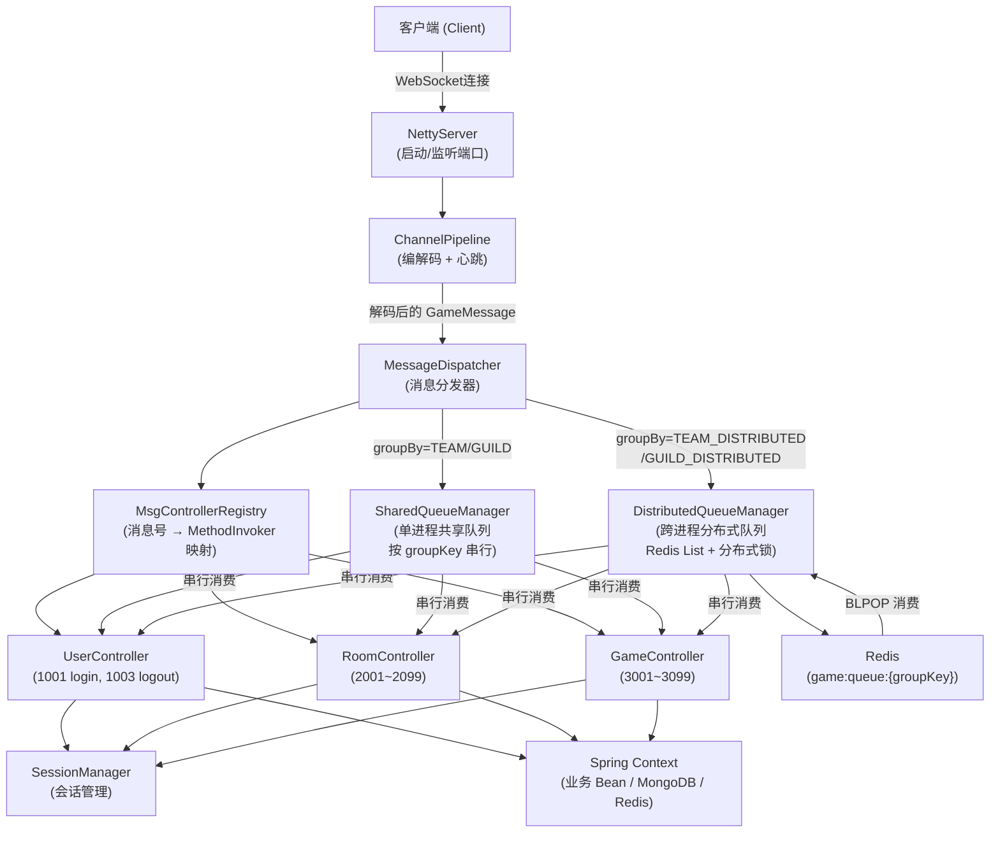
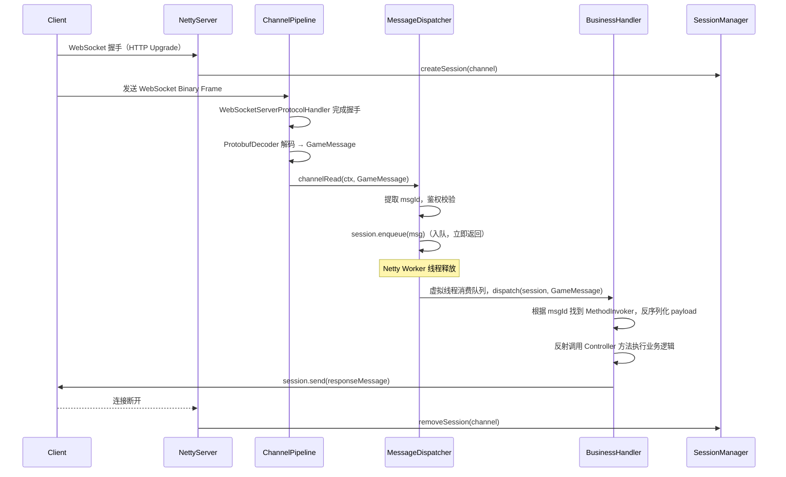

# 设计文档：休闲游戏服务器框架（game-server-framework）

## 概述

本框架是一个基于 Netty + Protobuf 的休闲游戏服务器框架，集成于现有 Spring Boot 4.0 / Java 21 项目中。
框架通过消息号（Message ID）将网络消息路由到对应的业务处理器（Handler），支持多种休闲游戏场景的快速接入。

核心设计目标：
- 高性能：Netty 异步非阻塞 I/O，支持大量并发连接
- 可扩展：通过注解自动注册消息处理器，业务开发者只需关注业务逻辑
- 协议统一：所有消息使用 Protobuf 序列化，消息头携带消息号用于路由

---

## 架构总览



---

## 序列图：消息处理主流程



---

## 协议设计

### Proto 消息命名规范

所有业务 Protobuf message 名称必须遵循 `C{msgId}_{MessageName}` 格式：

- `C{msgId}` 前缀中的数字即为该消息对应的协议号（msgId）
- 框架通过解析类名前缀 `C{msgId}_` 自动推导协议号，无需额外配置
- 命名示例：

| 消息名              | msgId | 说明       |
|---------------------|-------|------------|
| `C1001_LoginReq`    | 1001  | 登录请求   |
| `C1002_LoginResp`   | 1002  | 登录响应   |
| `C1003_LogoutReq`   | 1003  | 登出请求   |
| `C2001_CreateRoomReq`  | 2001  | 创建房间请求 |
| `C2002_CreateRoomResp` | 2002  | 创建房间响应 |

### Protobuf 消息定义

```protobuf
// proto/game_message.proto
syntax = "proto3";
package com.rainnov.framework.proto;

// 统一消息包装器
message GameMessage {
  int32  msg_id    = 1;  // 消息号（业务层约束为 short 范围：-32768~32767），用于路由
  int32  seq       = 2;  // 序列号，用于请求/响应匹配
  bytes  payload   = 3;  // 业务消息体（具体 proto 序列化后的字节）
  int32  error_code = 4; // 错误码，0 表示成功
}

// 心跳（系统消息，不使用 C{msgId}_ 前缀）
message HeartbeatReq { int64 timestamp = 1; }
message HeartbeatResp { int64 timestamp = 1; }
```

业务消息示例（遵循 `C{msgId}_{Name}` 命名规范）：

```protobuf
// proto/user.proto
syntax = "proto3";
package com.rainnov.framework.proto;

message C1001_LoginReq  { string token = 1; }
message C1002_LoginResp { int64 user_id = 1; }
message C1003_LogoutReq { }

// proto/room.proto
message C2001_CreateRoomReq  { string room_name = 1; int32 max_players = 2; }
message C2002_CreateRoomResp { int64 room_id = 1; }
```

### MsgId 常量类

所有协议号集中在 `MsgId.java` 中管理，按模块用嵌套静态类组织，**由 Gradle 任务自动生成，勿手动修改**：

```java
// 自动生成，勿手动修改
// 路径：src/main/java/com/rainnov/framework/proto/MsgId.java
public final class MsgId {

    public static final class LOGIN {
        public static final int LOGIN_REQ  = 1001;
        public static final int LOGIN_RESP = 1002;
        public static final int LOGOUT_REQ = 1003;
    }

    public static final class ROOM {
        public static final int CREATE_ROOM_REQ  = 2001;
        public static final int CREATE_ROOM_RESP = 2002;
    }

    // 其他模块按需生成...
}
```

#### 模块配置文件

模块范围映射从外部配置文件读取，路径为 `src/main/proto/msg-modules.properties`：

```properties
# 消息号模块映射配置
# 格式：{msgId范围起始值}={模块名}
# 规则：msgId 落在 [起始值, 下一个起始值) 区间时使用该模块名
# 特殊值 1 表示系统消息（1~999）
1=SYSTEM
1000=LOGIN
2000=ROOM
3000=GAME
4000=SOCIAL
5000=RESERVE
30000=ADMIN
```

此文件为必须提供的配置文件，`generateMsgId` 任务启动时读取并构建有序的范围→模块名映射。若某个 msgId 不在任何已定义范围内，回退到 `MODULE_{base}` 命名（base 为 msgId 向下取整到千位）。

#### generateMsgId Gradle 任务

`MsgId.java` 由自定义 Gradle 任务 `generateMsgId` 自动生成，流程如下：

```pascal
TASK generateMsgId
  INPUT:  src/main/proto/msg-modules.properties（模块范围配置）
          src/main/proto/ 目录下所有 .proto 文件
  OUTPUT: src/main/java/com/rainnov/framework/proto/MsgId.java

  SEQUENCE
    // 第一步：读取配置文件，构建有序范围→模块名映射
    rangeMap ← 读取 "src/main/proto/msg-modules.properties"
    sortedRanges ← rangeMap.keys().sortedDescending()  // 降序排列，便于范围查找

    // 第二步：扫描 .proto 文件，提取消息定义
    entries ← 空列表

    FOR each protoFile IN glob("src/main/proto/**/*.proto") DO
      FOR each line IN protoFile.lines() DO
        IF line 匹配正则 /message\s+C(\d+)_(\w+)/ THEN
          msgId   ← 捕获组1（数字）
          msgName ← 捕获组2（名称）
          entries.add({ msgId, msgName })
        END IF
      END FOR
    END FOR

    // 第三步：按配置文件中的范围映射归类消息号到模块
    moduleMap ← 空 Map<String, List<Entry>>

    FOR each entry IN entries DO
      moduleName ← resolveModule(entry.msgId, sortedRanges, rangeMap)
      moduleMap[moduleName].add(entry)
    END FOR

    // 第四步：生成 Java 源码
    写入文件头注释和 package 声明
    FOR each (moduleName, moduleEntries) IN moduleMap DO
      写入 "public static final class {moduleName} {"
      FOR each entry IN moduleEntries DO
        constName ← toUpperSnakeCase(entry.msgName)   // e.g. LoginReq → LOGIN_REQ
        写入 "    public static final int {constName} = {entry.msgId};"
      END FOR
      写入 "}"
    END FOR
  END SEQUENCE
END TASK

FUNCTION resolveModule(msgId, sortedRanges, rangeMap)
  // 在降序排列的起始值列表中找到第一个 ≤ msgId 的起始值
  FOR each rangeStart IN sortedRanges DO
    IF msgId >= rangeStart THEN
      RETURN rangeMap[rangeStart]   // 返回配置文件中对应的模块名
    END IF
  END FOR
  // 不在任何已定义范围内，回退到动态命名
  base ← (msgId / 1000) * 1000
  RETURN "MODULE_" + base           // e.g. MODULE_5000
END FUNCTION
```

`generateMsgId` 依赖 `generateProto`（先编译 proto 生成 Java 类），并在 `compileJava` 之前自动执行：

```groovy
// build.gradle
tasks.register('generateMsgId', JavaExec) {
    // ... 任务配置
}
generateMsgId.dependsOn generateProto   // 先执行 protoc 生成 Java 类
compileJava.dependsOn generateMsgId     // 再编译所有 Java 源码（含生成的类）
```

任务执行顺序：`generateProto` → `generateMsgId` → `compileJava`

### 消息号规划（Message ID 分段）

> msg_id 在 Protobuf 中使用 int32 存储，业务层约束在 short 范围（0~32767）内使用。

| 范围          | 用途                                         |
|---------------|----------------------------------------------|
| 1 ~ 999       | 系统消息（心跳、握手、错误通知）             |
| 1000 ~ 1999   | 账号/登录模块                                |
| 2000 ~ 2999   | 房间/匹配模块                                |
| 3000 ~ 3999   | 游戏内逻辑模块                               |
| 4000 ~ 4999   | 社交/好友模块                                |
| 5000 ~ 5999   | 预留模块（按需分配）                         |
| ...           | 每 1000 个号段对应一个模块，以此类推         |
| 30000+        | 管理/运维消息                                |

---

## 组件与接口

### 1. NettyServer

**职责**：启动 Netty WebSocket 服务，初始化 ChannelPipeline，与 Spring 生命周期集成；支持优雅停机。

```java
@Component
public class NettyServer implements InitializingBean, DisposableBean {

    private volatile boolean shuttingDown = false;

    void start(int port) throws InterruptedException;
    void shutdown();

    // 优雅停机：停止接受新连接，等待所有队列消费完毕后关闭
    void initiateGracefulShutdown();
}
```

### 2. GameChannelInitializer

**职责**：为每个新连接配置 ChannelPipeline 处理器链，完成 WebSocket 握手升级及 Protobuf 编解码；在 Pipeline 最前端检查最大连接数限制。

```java
@Component
public class GameChannelInitializer extends ChannelInitializer<SocketChannel> {

    @Override
    protected void initChannel(SocketChannel ch) {
        ChannelPipeline p = ch.pipeline();
        // 最前端：最大连接数检查（超限直接关闭，不发送任何响应）
        p.addFirst(new ChannelInboundHandlerAdapter() {
            @Override
            public void channelActive(ChannelHandlerContext ctx) {
                if (sessionManager.onlineCount() >= maxConnections) {
                    log.warn("连接数已达上限 {}，拒绝新连接", maxConnections);
                    ctx.close();
                    return;
                }
                ctx.fireChannelActive();
            }
        });
        // WebSocket 握手所需的 HTTP 编解码
        p.addLast(new HttpServerCodec());
        p.addLast(new HttpObjectAggregator(65536));
        // WebSocket 协议升级，path 为 "/ws"
        p.addLast(new WebSocketServerProtocolHandler("/ws", null, true));
        // Protobuf 编解码（WebSocket Binary Frame 内的字节）
        p.addLast(new ProtobufDecoder(GameMessage.getDefaultInstance()));
        p.addLast(new ProtobufEncoder());
        // 心跳检测：读空闲 60s
        p.addLast(new IdleStateHandler(60, 0, 0, TimeUnit.SECONDS));
        // 业务分发
        p.addLast(messageDispatcher);
    }
}
```

### 3. MessageDispatcher

**职责**：从 GameMessage 中提取 msgId，查找对应 Handler 并执行，处理异常。

```java
@Component
@ChannelHandler.Sharable
public class MessageDispatcher extends SimpleChannelInboundHandler<GameMessage> {

    // 连接建立：创建 Session
    void channelActive(ChannelHandlerContext ctx);

    // 连接断开：销毁 Session
    void channelInactive(ChannelHandlerContext ctx);

    // 消息分发核心逻辑：完成鉴权校验后将消息投入 Session 的专属队列
    void channelRead0(ChannelHandlerContext ctx, GameMessage msg);

    // 心跳超时处理
    void userEventTriggered(ChannelHandlerContext ctx, Object evt);
}
```

### 4. MsgControllerRegistry

**职责**：在 Spring 启动时扫描所有 `@MsgController` 注解的 Bean，遍历其 `@MsgMapping` 方法，建立 msgId → MethodInvoker 映射表；框架在消息到达时自动完成 payload 反序列化并通过反射调用对应方法。

```java
@Component
public class MsgControllerRegistry implements ApplicationContextAware {

    // 内部记录：封装反射调用所需的全部信息
    public record MethodInvoker(
        Object bean,
        Method method,
        Class<? extends Message> payloadType,
        GroupType groupType,   // 串行维度，来自 @MsgMapping.groupBy()
        boolean requireAuth    // 是否需要鉴权，来自 @MsgMapping.requireAuth()
    ) {}

    // 根据 msgId 查找 MethodInvoker（找不到返回 null）
    MethodInvoker find(int msgId);

    // 获取所有已注册的 msgId（用于调试）
    Set<Integer> registeredMsgIds();
}
```

### 5. @MsgController 注解

```java
@Target(ElementType.TYPE)
@Retention(RetentionPolicy.RUNTIME)
@Component  // 同时注册为 Spring Bean
public @interface MsgController {
    // 标记在类上，表示这是一个消息处理模块（类似 Spring 的 @Controller）
}
```

### 6. @MsgMapping 注解

```java
@Target(ElementType.METHOD)
@Retention(RetentionPolicy.RUNTIME)
public @interface MsgMapping {

    /** 该方法处理的消息号 */
    int value();

    /** 串行消费维度，默认按用户队列串行 */
    GroupType groupBy() default GroupType.USER;

    /** 是否需要登录才能访问，默认需要鉴权；登录接口等公开接口设为 false */
    boolean requireAuth() default true;
}

public enum GroupType {
    USER,              // 默认：按用户队列串行（现有行为）
    TEAM,              // 按队伍串行（同 teamId 的消息排队，单进程内）
    GUILD,             // 按公会串行（同 guildId 的消息排队，单进程内）
    TEAM_DISTRIBUTED,  // 按队伍串行（跨进程，Redis List + 分布式锁）
    GUILD_DISTRIBUTED, // 按公会串行（跨进程，Redis List + 分布式锁）
}
```

### 6.1 GroupKeyResolver 接口

框架从 `GameSession` 中提取对应的 `groupKey`（如 teamId、guildId），由业务层实现并注册为 Spring Bean：

```java
public interface GroupKeyResolver {

    /**
     * 从 session 中解析 groupKey
     * @return groupKey 字符串，如 "team:123"、"guild:456"；
     *         返回 null 表示无法解析，消息降级到用户队列
     */
    String resolve(GameSession session, GroupType groupType);
}
```

业务层示例实现：

```java
@Component
public class GameGroupKeyResolver implements GroupKeyResolver {

    @Override
    public String resolve(GameSession session, GroupType groupType) {
        return switch (groupType) {
            case TEAM, TEAM_DISTRIBUTED -> {
                Long teamId = session.getTeamId();
                yield teamId != null ? "team:" + teamId : null;
            }
            case GUILD, GUILD_DISTRIBUTED -> {
                Long guildId = session.getGuildId();
                yield guildId != null ? "guild:" + guildId : null;
            }
            default -> null;
        };
    }
}
```

### 7. GameSession

**职责**：封装单个客户端连接的状态，提供发送消息的便捷方法。

```java
public class GameSession {

    private final String   sessionId;   // UUID
    private final Channel  channel;     // Netty Channel
    private       long     userId;      // 登录后绑定
    private       boolean  authenticated;
    private final long     createTime;
    private       long     lastActiveTime;

    // 发送消息给客户端
    void send(GameMessage message);

    // 关闭连接
    void close();

    boolean isAuthenticated();
    void    bindUser(long userId);
}
```

### 7. GameSession

**职责**：封装单个客户端连接的状态，提供发送消息的便捷方法；每个 Session 拥有独立的消息队列和专属虚拟线程，保证单用户消息串行消费；内置令牌桶限流，支持优雅停机。

```java
public class GameSession {

    private final String                          sessionId;       // UUID
    private final Channel                         channel;         // Netty Channel
    private       long                            userId;          // 登录后绑定
    private       boolean                         authenticated;
    private final long                            createTime;
    private       long                            lastActiveTime;
    private final LinkedBlockingQueue<GameMessage> messageQueue = new LinkedBlockingQueue<>(256);   // 用户专属消息队列（有界，容量256）
    private final Thread                          consumerThread;  // 专属虚拟线程（消费消息队列）
    private volatile boolean                      acceptingMessages = true;  // 停机时设为 false
    private final RateLimiter                     rateLimiter;     // 令牌桶限流（Guava），默认 30 req/s

    // 将消息投入用户专属队列（由 Netty Worker 线程调用，非阻塞）
    void enqueue(GameMessage message) {
        if (!acceptingMessages) return;  // 停机期间静默丢弃
        if (!messageQueue.offer(message)) {
            log.warn("消息队列已满，丢弃消息: sessionId={}, msgId={}", sessionId, message.getMsgId());
        }
    }

    // 限流检查（非阻塞，立即返回是否获取到令牌）
    boolean tryAcquireRateLimit() {
        return rateLimiter.tryAcquire();
    }

    // 停机时调用：停止接受新消息
    void stopAcceptingMessages() { this.acceptingMessages = false; }

    // 等待消费线程退出（投入毒丸后 join，最多等待 timeout）
    void awaitConsumerTermination(long timeout, TimeUnit unit);

    // 发送消息给客户端
    void send(GameMessage message);

    // 关闭连接并停止消费线程
    void close();

    boolean isAuthenticated();
    void    bindUser(long userId);
}
```

### 8. SessionManager

**职责**：管理所有在线 Session，支持按 channelId 和 userId 查找。

```java
@Component
public class SessionManager {

    GameSession createSession(Channel channel);
    void        removeSession(Channel channel);
    GameSession getByChannel(Channel channel);
    GameSession getByUserId(long userId);
    int         onlineCount();
    Collection<GameSession> getAllSessions();
}
```

### 9. ServerMetrics（监控指标）

**职责**：收集并定期（默认每 60s）将关键运行指标打印到日志（INFO 级别），后续可扩展接入 Prometheus。

```java
@Component
public class ServerMetrics {

    private final AtomicLong onlineConnections = new AtomicLong();   // 当前在线连接数
    private final AtomicLong totalConnections  = new AtomicLong();   // 累计连接总数
    private final AtomicLong messagesReceived  = new AtomicLong();   // 累计收到消息数
    private final AtomicLong messagesDropped   = new AtomicLong();   // 累计丢弃消息数（队列满 + 限流）

    // 每 60s 打印一次指标摘要（INFO 级别）
    @Scheduled(fixedDelay = 60_000)
    public void logMetrics() {
        log.info("[ServerMetrics] online={}, total={}, received={}, dropped={}, sharedQueues={}, avgLatency={}ms",
            onlineConnections.get(), totalConnections.get(),
            messagesReceived.get(), messagesDropped.get(),
            sharedQueueManager.activeQueueCount(),
            handlerLatencyTracker.avgMs());
    }
}
```

**监控指标说明**：

| 指标                   | 说明                                   |
|------------------------|----------------------------------------|
| online_connections     | 当前在线连接数                         |
| total_connections      | 累计连接总数                           |
| messages_received      | 累计收到消息数                         |
| messages_dropped       | 累计丢弃消息数（队列满 + 限流）        |
| queue_max_size         | 所有用户队列中最大积压数               |
| shared_queue_count     | 当前活跃的 SharedQueue 数量            |
| avg_handler_latency_ms | 消息处理平均延迟（ms）                 |

### 9. SharedQueueManager（单进程共享队列）

**职责**：管理进程内按 `groupKey` 串行消费的共享队列，每个 `groupKey` 对应一个独立的有界队列和专属虚拟线程；队列空闲超过一定时间后自动销毁，防止内存泄漏。

```java
@Component
public class SharedQueueManager {

    // key: groupKey（如 "team:123"），value: 共享队列
    private final ConcurrentHashMap<String, SharedQueue> queueMap = new ConcurrentHashMap<>();

    // 获取或创建 groupKey 对应的共享队列（线程安全）
    SharedQueue getOrCreate(String groupKey);

    // 当队列空闲超过 idleTimeoutMs 后自动销毁（由定时任务触发）
    void cleanup(String groupKey);
}

class SharedQueue {
    private final String groupKey;
    private final LinkedBlockingQueue<GroupMessage> queue = new LinkedBlockingQueue<>(1024);
    private final Thread consumerThread;  // 虚拟线程，串行消费
    private volatile long lastActiveTime; // 最后活跃时间，用于空闲检测

    // 将消息投入队列（非阻塞，满时丢弃并记录 WARN）
    void enqueue(GroupMessage message);
}

// 共享队列消息包装，携带原始 GameMessage 和发送方 Session
record GroupMessage(GameSession session, GameMessage message) {}
```

**空闲自动销毁机制**：`SharedQueueManager` 内部启动一个定时任务（默认每 30s 扫描一次），对 `queueMap` 中所有队列检查 `lastActiveTime`，超过空闲阈值（默认 5 分钟）且队列为空时，中断消费线程并从 `queueMap` 中移除，释放内存。

### 10. DistributedQueueManager（跨进程分布式队列）

**职责**：使用 Redis List 作为跨进程消息队列，配合分布式锁保证同一 `groupKey` 同时只有一个节点在消费；仅 `GroupType.TEAM_DISTRIBUTED` / `GUILD_DISTRIBUTED` 的消息使用此路径。

```java
@Component
public class DistributedQueueManager {

    // 入队：RPUSH game:queue:{groupKey} {serializedGroupMessage}
    void enqueue(String groupKey, GroupMessage message);

    // 启动消费循环（每个 groupKey 一个虚拟线程）
    // 消费逻辑：
    //   1. SET NX PX 5000 尝试获取分布式锁 game:lock:{groupKey}
    //   2. 获取锁成功 → BLPOP game:queue:{groupKey} → 执行 Handler → 释放锁
    //   3. 获取锁失败 → 其他节点正在消费，等待后重试
    void startConsumer(String groupKey);
}
```

**Redis 键规范**：

| 键                          | 类型   | 说明                                 |
|-----------------------------|--------|--------------------------------------|
| `game:queue:{groupKey}`     | List   | 消息队列，RPUSH 入队，BLPOP 消费     |
| `game:lock:{groupKey}`      | String | 分布式锁，SET NX PX 5000（5s 超时）  |

**消息序列化**：`GroupMessage`（session 元信息 + GameMessage bytes）序列化为 JSON 存入 Redis。

**跨节点响应路由**：跨进程时消费节点可能不持有原始连接，Handler 执行完后需通过节点间通信将响应路由回原始连接节点。此部分为框架扩展点，当前版本标记为 **TODO**。

---

## 数据模型

### GameMessage（Protobuf 生成类，核心传输对象）

| 字段       | 类型   | 说明                                                         |
|------------|--------|--------------------------------------------------------------|
| msg_id     | int32  | 消息号（业务层约束为 short 范围，0~32767），路由键           |
| seq        | int32  | 序列号，客户端自增                                           |
| payload    | bytes  | 业务 proto 序列化字节                                        |
| error_code | int32  | 0=成功，非0=错误                                             |

### GameSession（内存对象）

| 字段              | 类型                               | 说明                                                                                     |
|-------------------|------------------------------------|------------------------------------------------------------------------------------------|
| sessionId         | String                             | UUID，唯一标识                                                                           |
| channel           | Channel                            | Netty Channel                                                                            |
| userId            | long                               | 登录后绑定，0=未登录                                                                     |
| authenticated     | boolean                            | 是否已认证                                                                               |
| createTime        | long                               | 连接建立时间戳                                                                           |
| lastActiveTime    | long                               | 最后活跃时间戳                                                                           |
| messageQueue      | LinkedBlockingQueue\<GameMessage\> | 有界阻塞队列，容量 256，满时丢弃新消息                                                   |
| consumerThread    | Thread                             | 专属虚拟线程（`Thread.ofVirtual()`），Session 创建时启动，销毁时中断                     |
| acceptingMessages | volatile boolean                   | 是否接受新消息，停机时设为 false，`enqueue()` 检查此标志                                 |
| rateLimiter       | RateLimiter                        | Guava 令牌桶，默认 30 req/s（可配置），`tryAcquireRateLimit()` 非阻塞检查               |

---

## 关键算法与函数规范

### 消息分发算法（Netty Worker 线程）

```java
// MessageDispatcher.channelRead0
@Override
protected void channelRead0(ChannelHandlerContext ctx, GameMessage msg) {
    GameSession session = sessionManager.getByChannel(ctx.channel());
    if (session == null) return;

    session.setLastActiveTime(System.currentTimeMillis());

    int msgId = msg.getMsgId();

    // 基于 @MsgMapping.requireAuth 的鉴权校验（不再硬编码 msgId 范围）
    MethodInvoker invoker = msgControllerRegistry.find(msgId);
    if (invoker != null && invoker.requireAuth() && !session.isAuthenticated()) {
        session.send(buildErrorResponse(msg, ErrorCode.NOT_AUTHENTICATED));
        return;
    }
    // 找不到 Handler 且未登录时也拦截（防止未认证连接探测未知接口）
    if (invoker == null && !session.isAuthenticated()) {
        session.send(buildErrorResponse(msg, ErrorCode.NOT_AUTHENTICATED));
        return;
    }

    // 鉴权校验通过后，根据 @MsgMapping.groupBy 决定入队目标
    if (invoker != null && invoker.groupType() != GroupType.USER) {
        GroupType groupType = invoker.groupType();

        if (groupType == GroupType.TEAM_DISTRIBUTED || groupType == GroupType.GUILD_DISTRIBUTED) {
            // 跨进程分布式队列（Redis）
            String groupKey = groupKeyResolver.resolve(session, groupType);
            if (groupKey != null) {
                distributedQueueManager.enqueue(groupKey, new GroupMessage(session, msg));
                return;
            }
            // groupKey 为 null 时降级到用户队列（见下方）
        } else {
            // 单进程共享队列（TEAM / GUILD）
            String groupKey = groupKeyResolver.resolve(session, groupType);
            if (groupKey != null) {
                sharedQueueManager.getOrCreate(groupKey).enqueue(new GroupMessage(session, msg));
                return;
            }
            // groupKey 为 null 时降级到用户队列（见下方）
        }
    }

    // 默认：投入用户专属队列，立即返回，不阻塞 Netty I/O 线程
    session.enqueue(msg);
}
```

**前置条件**：
- `ctx.channel()` 对应的 Session 已在 `channelActive` 时创建
- `msg` 已由 Protobuf 解码器完整解码

**后置条件**：
- 消息已入队（用户队列 / 单进程共享队列 / 分布式队列之一），Netty Worker 线程立即释放
- 未通过鉴权的消息直接在 Netty 线程返回错误响应（轻量操作，可接受）
- `groupKey` 解析为 null 时自动降级到用户队列，保证消息不丢失

**循环不变量**：N/A（无循环，单次入队）

---

### 用户消息队列消费算法（虚拟线程）

```java
// GameSession 构造时启动，消费专属 messageQueue
private Runnable buildConsumerTask() {
    return () -> {
        while (!Thread.currentThread().isInterrupted()) {
            try {
                // 阻塞等待消息（虚拟线程挂起，不占用平台线程）
                GameMessage msg = messageQueue.take();

                // 毒丸消息：收到后退出消费循环
                if (msg == POISON_PILL) break;

                int msgId = msg.getMsgId();
                MsgControllerRegistry.MethodInvoker invoker = msgControllerRegistry.find(msgId);
                if (invoker == null) {
                    send(buildErrorResponse(msg, ErrorCode.HANDLER_NOT_FOUND));
                    continue;
                }

                // 自动反序列化 payload 为强类型 proto 对象
                Message payload = invoker.payloadType().parseFrom(msg.getPayload());

                // 通过反射调用 Controller 方法，天然保证单用户消息顺序
                // 若返回 protobuf Message 子类，框架自动包装为 GameMessage 发送（响应号 = 请求号 + 1）
                Object result = invoker.method().invoke(invoker.bean(), this, payload);
                if (result instanceof Message responseProto) {
                    int respMsgId = msg.getMsgId() + 1;
                    send(GameMessage.newBuilder()
                        .setMsgId(respMsgId)
                        .setSeq(msg.getSeq())
                        .setPayload(responseProto.toByteString())
                        .build());
                }
                // 返回 null 或 void：业务自行调用 session.send()，框架不发送任何响应

            } catch (InterruptedException e) {
                Thread.currentThread().interrupt(); // 恢复中断标志，退出循环
            } catch (Exception e) {
                log.error("Handler error, sessionId={}", sessionId, e);
                // 单条消息异常不影响后续消息处理，继续消费
            }
        }
    };
}

// Session 创建时启动虚拟线程
this.consumerThread = Thread.ofVirtual()
    .name("session-consumer-" + sessionId)
    .start(buildConsumerTask());

// Session 销毁时停止消费（两种方式二选一）
// 方式一：投入毒丸消息（优雅停止，处理完队列中已有消息）
messageQueue.put(POISON_PILL);
// 方式二：直接中断（立即停止，丢弃队列中未处理消息）
consumerThread.interrupt();
```

**前置条件**：
- `msgControllerRegistry` 已完成初始化
- `messageQueue` 为有界或无界 `LinkedBlockingQueue`

**后置条件**：
- 同一用户的消息严格按入队顺序串行执行
- 虚拟线程在 Session 销毁后必定退出，不泄漏
- 单条消息的 payload 反序列化或方法调用异常不影响该用户后续消息的处理

### MsgControllerRegistry 初始化算法

```java
// MsgControllerRegistry.afterPropertiesSet
@Override
public void afterPropertiesSet() {
    Map<String, Object> beans = applicationContext.getBeansWithAnnotation(MsgController.class);
    for (Object bean : beans.values()) {
        for (Method method : bean.getClass().getDeclaredMethods()) {
            MsgMapping mapping = method.getAnnotation(MsgMapping.class);
            if (mapping == null) continue;

            int msgId = mapping.value();
            Parameter[] params = method.getParameters();

            // 方法签名校验：必须是 (GameSession, XxxReq) 形式
            if (params.length != 2 || !Message.class.isAssignableFrom(params[1].getType())) {
                throw new IllegalStateException(
                    method + " 的第二个参数必须是 com.google.protobuf.Message 的子类");
            }

            if (invokerMap.containsKey(msgId)) {
                throw new IllegalStateException("msgId=" + msgId + " 存在重复注册");
            }

            // Fail-Fast：从参数类名前缀 C{msgId}_ 解析出 msgId，与 @MsgMapping 值做一致性校验
            String paramClassName = params[1].getType().getSimpleName();
            if (paramClassName.matches("C\\d+_.*")) {
                int inferredMsgId = Integer.parseInt(paramClassName.substring(1, paramClassName.indexOf('_')));
                if (inferredMsgId != msgId) {
                    throw new IllegalStateException(
                        method + ": @MsgMapping(" + msgId + ") 与参数类名 " + paramClassName +
                        " 推导出的 msgId=" + inferredMsgId + " 不一致，请检查注解或类名");
                }
            }

            @SuppressWarnings("unchecked")
            Class<? extends Message> payloadType = (Class<? extends Message>) params[1].getType();
            invokerMap.put(msgId, new MethodInvoker(bean, method, payloadType, mapping.groupBy(), mapping.requireAuth()));
            log.info("注册 MsgMapping: msgId={} -> {}.{}()",
                msgId, bean.getClass().getSimpleName(), method.getName());
        }
    }
}
```

**前置条件**：Spring Context 已完成所有 Bean 的实例化

**后置条件**：
- `invokerMap` 中每个 msgId 唯一对应一个 MethodInvoker
- 方法签名不合法或 msgId 重复时快速失败（Fail-Fast）
- `@MsgMapping` 值与参数类名前缀 `C{msgId}_` 推导出的 msgId 不一致时快速失败（Fail-Fast）

---

### 优雅停机流程

停机触发方式：JVM ShutdownHook（`Runtime.getRuntime().addShutdownHook()`）或管理消息（msgId=30001）。

```pascal
PROCEDURE initiateGracefulShutdown
  SEQUENCE
    // 第一步：设置全局停机标志，停止接受新连接
    shuttingDown ← true

    // 第二步：通知所有 Session 停止入队
    FOR each session IN sessionManager.getAllSessions() DO
      session.stopAcceptingMessages()
    END FOR

    // 第三步：等待所有用户队列消费完毕（最多 30s）
    FOR each session IN sessionManager.getAllSessions() DO
      session.awaitConsumerTermination(30, SECONDS)
    END FOR

    // 第四步：等待所有 SharedQueue 消费完毕（最多 30s）
    sharedQueueManager.awaitAllQueues(30, SECONDS)

    // 第五步：关闭 Netty EventLoopGroup，Spring Context 销毁
    shutdown()
  END SEQUENCE
END PROCEDURE
```

**`awaitConsumerTermination` 实现**：向 `messageQueue` 投入毒丸消息（`POISON_PILL`），消费线程收到后退出循环，随后 `consumerThread.join(timeout)` 等待线程结束。超时后强制中断。

**停机期间行为**：
- `GameSession.enqueue()` 检查 `acceptingMessages`，为 `false` 时静默丢弃新消息
- `MessageDispatcher.channelRead0()` 检查 `shuttingDown`，为 `true` 时不再入队（直接丢弃或返回维护错误码）
- 超时（默认 30s）后强制关闭剩余连接，不等待队列清空

---

## 业务 Controller 示例

```java
// 登录模块 Controller 示例：一个类处理多个消息号
@MsgController
public class UserController {

    @Autowired
    private UserService userService;

    // requireAuth=false：登录接口无需鉴权
    // 返回 C1002_LoginResp，框架自动包装为 GameMessage(msgId=1002) 发送
    @MsgMapping(value = MsgId.LOGIN.LOGIN_REQ, requireAuth = false)   // 1001
    public C1002_LoginResp login(GameSession session, C1001_LoginReq req) throws Exception {
        long userId = userService.login(req.getToken());
        session.bindUser(userId);
        return C1002_LoginResp.newBuilder().setUserId(userId).build();
        // 框架自动将此对象包装为 GameMessage(msgId=1002, seq=请求seq) 发送，无需手动 session.send()
    }

    @MsgMapping(MsgId.LOGIN.LOGOUT_REQ)  // 1003，默认 requireAuth=true
    public void logout(GameSession session, C1003_LogoutReq req) throws Exception {
        userService.logout(session.getUserId());
        session.close();
        // 返回 void：框架不发送任何响应
    }
}
```

```java
// 游戏模块 Controller 示例：使用 groupBy 保证队伍内消息串行
@MsgController
public class GameController {

    @Autowired
    private TeamService teamService;

    // 同一 teamId 的消息在单进程内串行执行，避免队伍状态并发修改
    @MsgMapping(value = MsgId.GAME.TEAM_ACTION_REQ, groupBy = GroupType.TEAM)  // 3001
    public void handleTeamAction(GameSession session, C3001_TeamActionReq req) throws Exception {
        teamService.processAction(session.getTeamId(), req);
        // 响应直接通过 session 发回，session 持有原始连接
        session.send(buildResp(MsgId.GAME.TEAM_ACTION_RESP));
    }

    // 跨服场景：同一 teamId 的消息跨进程串行（Redis 分布式队列）
    @MsgMapping(value = MsgId.GAME.CROSS_SERVER_REQ, groupBy = GroupType.TEAM_DISTRIBUTED)  // 3002
    public void handleCrossServer(GameSession session, C3002_CrossServerReq req) throws Exception {
        teamService.processCrossServer(session.getTeamId(), req);
        // TODO: 跨节点响应路由（当前版本标记为扩展点）
    }
}
```

---

## 错误处理

### 错误场景

| 场景                   | 处理方式                                      |
|------------------------|-----------------------------------------------|
| 未找到 MethodInvoker   | 返回 `error_code=404` 的 GameMessage          |
| 未认证访问受保护消息   | 返回 `error_code=401`，不断开连接             |
| payload 反序列化失败   | 捕获 `InvalidProtocolBufferException`，返回 `error_code=400`，记录日志 |
| Controller 方法抛出异常 | 捕获异常，返回 `error_code=500`，记录日志    |
| 心跳超时（60s无读事件）| 主动关闭 Channel，触发 channelInactive        |
| Protobuf 解码失败      | Netty ExceptionCaught，关闭连接               |
| 消息体过大（>64KB）    | LengthFieldDecoder 拒绝，关闭连接             |
| 消息队列已满（积压超过256条） | 丢弃新消息，记录 WARN 日志，不断开连接 |
| SharedQueue 队列已满（积压超过1024条） | 丢弃新消息，记录 WARN 日志，不断开连接 |
| groupKey 解析返回 null | 降级到用户专属队列，保证消息不丢失，记录 DEBUG 日志 |
| Redis 不可用（分布式队列）| 自动降级到本地 `SharedQueueManager` 单进程共享队列；记录 ERROR 日志并上报告警；Redis 恢复后不自动迁移已降级的消息（接受短暂跨进程顺序弱化） |
| 分布式锁获取超时       | 等待后重试，超过最大重试次数则降级到本地共享队列，记录 WARN 日志 |
| 连接数超限（≥ maxConnections） | `GameChannelInitializer` 直接关闭新连接，不发送任何响应，记录 WARN 日志 |
| 消息频率超限（令牌桶耗尽）| 静默丢弃消息，不发送错误响应（防止放大攻击），记录 WARN 日志，`messagesDropped` 计数器递增 |
| 停机期间收到新消息     | `GameSession.enqueue()` 检查 `acceptingMessages`，静默丢弃 |

---

## 测试策略

### 单元测试

- `MsgControllerRegistry`：验证注解扫描、方法签名校验、重复 msgId 检测、MethodInvoker 构建
- `MessageDispatcher`：Mock Session/Registry，验证路由逻辑、未认证拦截、异常处理
- `SessionManager`：验证 Session 创建/销毁/查找

### 集成测试

- 启动嵌入式 Netty Server，使用 WebSocket 客户端发送真实 Protobuf 消息，验证端到端流程
- 验证心跳超时后连接被正确关闭

### 属性测试（Property-Based）

- 任意合法 msgId 的消息必定得到响应（成功或错误）
- 未注册 msgId 的消息必定返回 404 错误码
- 并发 N 个连接同时发送消息，SessionManager 中 onlineCount 始终准确

---

## 性能考量

- Netty Boss/Worker 线程组分离：Boss 1线程接受连接，Worker 线程数 = CPU核心数×2
- Netty I/O 线程只负责 Protobuf 解码 + 消息入队，不执行任何业务逻辑，最大化 I/O 吞吐
- 每个用户拥有独立的 `LinkedBlockingQueue<GameMessage>` + 专属虚拟线程（`Thread.ofVirtual()`）：
  - 虚拟线程由 JVM 调度，创建/销毁开销极低（相比平台线程），支持数万并发用户
  - 单用户消息天然串行消费，无需额外加锁保证顺序
  - 虚拟线程在 `messageQueue.take()` 阻塞时挂起，不占用平台线程，不浪费 CPU
- `SharedQueueManager` 共享队列空闲自动销毁：
  - 每个 `groupKey` 对应一个 `SharedQueue`（有界队列容量 1024 + 虚拟线程），按需创建
  - 定时任务（默认每 30s）扫描所有 `SharedQueue`，空闲超过 5 分钟且队列为空时自动销毁
  - 销毁时中断消费线程并从 `ConcurrentHashMap` 中移除，防止长期不活跃的队伍/公会占用内存
  - 下次有消息到来时重新创建，对业务透明
- `DistributedQueueManager` 分布式队列仅在声明了 `TEAM_DISTRIBUTED` / `GUILD_DISTRIBUTED` 的消息上启用，不影响默认消息路径的性能
- Protobuf 序列化性能优于 JSON，适合高频小包场景
- SessionManager 使用 `ConcurrentHashMap` 保证线程安全
- 最大连接数限制（默认 10000，可配置 `game.server.max-connections`）：在 Pipeline 最前端拦截，超限直接关闭连接，保护服务器资源
- 令牌桶限流（默认每用户 30 req/s，可配置 `game.server.rate-limit.per-second`）：`tryAcquire()` 非阻塞，超限静默丢弃，防止单用户消息洪泛拖垮队列
- `ServerMetrics` 定期（默认 60s）打印关键指标到日志，便于运维监控；后续可扩展接入 Prometheus/Grafana

---

## 安全考量

- 消息体大小限制（默认 64KB），防止内存攻击
- 基于 `@MsgMapping.requireAuth` 的细粒度鉴权：默认所有接口需要登录，公开接口（如登录）显式声明 `requireAuth=false`，不再依赖硬编码 msgId 范围
- 最大连接数限制（默认 10000），防止连接耗尽攻击
- 令牌桶限流（默认 30 req/s/用户），防止单用户消息洪泛；超限静默丢弃，不发送错误响应（防止放大攻击）
- 心跳超时自动断开，防止僵尸连接占用资源
- Token 验证逻辑在 LoginHandler 中实现，框架层不感知具体认证方式

---

## 依赖

需在 `build.gradle` 中新增：

```groovy
// Netty
implementation 'io.netty:netty-all:4.1.115.Final'

// Protobuf
implementation 'com.google.protobuf:protobuf-java:4.29.3'

// Guava（令牌桶限流 RateLimiter）
implementation 'com.google.guava:guava:33.3.1-jre'

// Protobuf Gradle 插件（用于编译 .proto 文件）
id 'com.google.protobuf' version '0.9.4'

// 自定义 generateMsgId 任务（扫描 .proto 文件，自动生成 MsgId.java）
// 任务实现放在 buildSrc/ 或 build.gradle 的 tasks.register 块中
// generateMsgId.dependsOn generateProto 确保 protoc 先生成 Java 类
// compileJava.dependsOn generateMsgId 确保在编译前自动执行
```

**必须提供的配置文件**：`src/main/proto/msg-modules.properties`，定义 msgId 范围到模块名的映射，`generateMsgId` 任务依赖此文件运行。

现有依赖（MongoDB、Redis、Lombok）保持不变，可在业务 Handler 中直接使用。

**分布式队列依赖说明**：`DistributedQueueManager` 依赖 Redis（项目已有 `spring-boot-starter-data-redis` 依赖），无需额外引入。仅当消息注解声明了 `GroupType.TEAM_DISTRIBUTED` 或 `GUILD_DISTRIBUTED` 时才会访问 Redis，不影响未使用分布式队列的服务实例。Redis 不可用时自动降级到本地 `SharedQueueManager`，保证服务可用性。

---

## 正确性属性（Correctness Properties）

*属性是在系统所有合法执行中都应成立的特征或行为——本质上是关于系统应做什么的形式化陈述。属性是人类可读规范与机器可验证正确性保证之间的桥梁。*

### 属性 1：未认证访问受保护接口返回 401

*对于任意* 未认证的 GameSession 和任意 requireAuth=true 的 msgId，MessageDispatcher 处理该消息后，客户端应收到 error_code=401 的 GameMessage，且连接不断开。

**Validates: Requirements 3.2, 3.3**

---

### 属性 2：requireAuth=false 的接口允许未认证访问

*对于任意* 未认证的 GameSession 和任意 requireAuth=false 的 msgId，MessageDispatcher 不应拦截该消息，消息应正常进入处理队列。

**Validates: Requirements 3.2, 13.4**

---

### 属性 3：消息路由到正确队列

*对于任意* 已注册的 MethodInvoker，当 groupType 为 USER 时消息进入用户专属队列；当 groupType 为 TEAM/GUILD 且 groupKey 非 null 时进入 SharedQueueManager；当 groupType 为 TEAM_DISTRIBUTED/GUILD_DISTRIBUTED 且 groupKey 非 null 时进入 DistributedQueueManager；当 groupKey 为 null 时降级到用户专属队列。

**Validates: Requirements 3.4, 3.5, 3.6, 13.5, 13.6**

---

### 属性 4：停机期间不入队新消息

*对于任意* 在优雅停机触发后到达的消息，MessageDispatcher 不应将其投入任何队列（用户队列、共享队列或分布式队列）。

**Validates: Requirements 1.4, 3.8**

---

### 属性 5：MsgControllerRegistry 注册完整性

*对于任意* 标注了 `@MsgController` 和 `@MsgMapping` 的合法方法，注册后通过 `find(msgId)` 应能查到包含 bean、method、payloadType、groupType、requireAuth 全部字段的 MethodInvoker；对于任意未注册的 msgId，`find()` 应返回 null。

**Validates: Requirements 4.2, 4.6**

---

### 属性 6：重复 msgId / 非法签名 / 命名不一致时 Fail-Fast

*对于任意* 导致 msgId 重复、方法第二个参数非 Protobuf Message 子类、或 `@MsgMapping` value 与参数类名前缀不一致的注册场景，MsgControllerRegistry 应在启动时抛出 IllegalStateException。

**Validates: Requirements 4.3, 4.4, 4.5, 11.6**

---

### 属性 7：Session 生命周期与计数准确性

*对于任意* 连接/断开操作序列，SessionManager 中的在线连接数应始终等于当前活跃 Session 的实际数量；通过 Channel 或 userId 查找 Session 应与创建时关联的 Session 一致；断开后查找应返回 null。

**Validates: Requirements 5.1, 5.2, 5.3, 5.4, 5.5, 10.3**

---

### 属性 8：用户认证绑定

*对于任意* GameSession，调用 `bindUser(userId)` 后，`isAuthenticated()` 应返回 true，`getUserId()` 应返回绑定的 userId。

**Validates: Requirements 5.6**

---

### 属性 9：消息处理器正确调用

*对于任意* 已注册的 msgId 和合法 payload，消费线程应找到对应 MethodInvoker，将 payload 反序列化为正确的 Protobuf 类型，并通过反射调用 Controller 方法。

**Validates: Requirements 6.4, 13.3**

---

### 属性 10：自动响应包装（msgId + 1）

*对于任意* Controller 方法返回 Protobuf Message 子类的情况，框架自动发送的响应 GameMessage 的 msgId 应等于请求 msgId + 1，seq 应等于请求 seq。

**Validates: Requirements 6.5**

---

### 属性 11：单条消息异常不中断消费线程

*对于任意* 包含一条会抛出异常的消息和若干正常消息的序列，消费线程在处理异常消息后应继续处理后续消息，不中断。

**Validates: Requirements 6.7**

---

### 属性 12：未注册 msgId 返回 404

*对于任意* 未在 MsgControllerRegistry 中注册的 msgId，消费线程处理该消息后应向客户端返回 error_code=404 的 GameMessage。

**Validates: Requirements 12.1**

---

### 属性 13：错误 payload 返回 400，Handler 异常返回 500

*对于任意* 无法反序列化为目标 Protobuf 类型的 payload，消费线程应返回 error_code=400；对于任意 Controller 方法抛出异常的情况，应返回 error_code=500。

**Validates: Requirements 12.2, 12.3**

---

### 属性 14：SharedQueueManager getOrCreate 幂等性

*对于任意* groupKey，多次调用 `getOrCreate(groupKey)` 应返回同一个 SharedQueue 实例（线程安全，不重复创建）。

**Validates: Requirements 7.1**

---

### 属性 15：SharedQueue 空闲超时自动销毁

*对于任意* 空闲时间超过阈值且队列为空的 SharedQueue，cleanup 后该 groupKey 对应的队列应从 SharedQueueManager 中移除；下次 `getOrCreate` 时重新创建新实例。

**Validates: Requirements 7.4**

---

### 属性 16：DistributedQueueManager 入队后可消费（序列化往返）

*对于任意* GroupMessage（包含 session 元信息和 GameMessage），将其序列化为 JSON 存入 Redis 后，反序列化应得到等价的 GroupMessage 对象。

**Validates: Requirements 8.1, 8.5**

---

### 属性 17：Redis 不可用时降级到本地队列

*对于任意* Redis 不可用的情况，DistributedQueueManager 应将消息路由到本地 SharedQueueManager 处理，保证消息不丢失。

**Validates: Requirements 8.3**

---

### 属性 18：限流超限时静默丢弃且计数器递增

*对于任意* 超过令牌桶速率的消息突发，超限消息应被静默丢弃（不发送错误响应），且 ServerMetrics 的 messagesDropped 计数器应相应递增。

**Validates: Requirements 9.2, 9.3, 10.4**

---

### 属性 19：ServerMetrics 指标追踪完整性

*对于任意* 连接建立/断开/消息收到/消息丢弃事件序列，ServerMetrics 中对应的计数器（onlineConnections、totalConnections、messagesReceived、messagesDropped）应准确反映事件发生次数。

**Validates: Requirements 10.1, 10.3**

---

### 属性 20：generateMsgId 任务正确解析并归类消息号

*对于任意* 包含 `C{msgId}_{MessageName}` 格式消息的 .proto 文件集合和 msg-modules.properties 配置，generateMsgId 任务生成的 MsgId.java 应包含所有消息号常量，且每个常量归属于配置文件中对应范围的模块嵌套类；对于范围外的 msgId，应归入 `MODULE_{base}` 类。

**Validates: Requirements 11.1, 11.2, 11.3, 11.4**

---

### 属性 21：连接数超限时拒绝新连接

*对于任意* 在线连接数已达 maxConnections 上限的情况，新建立的连接应被立即关闭，不发送任何响应，且在线连接数不超过 maxConnections。

**Validates: Requirements 2.2**
