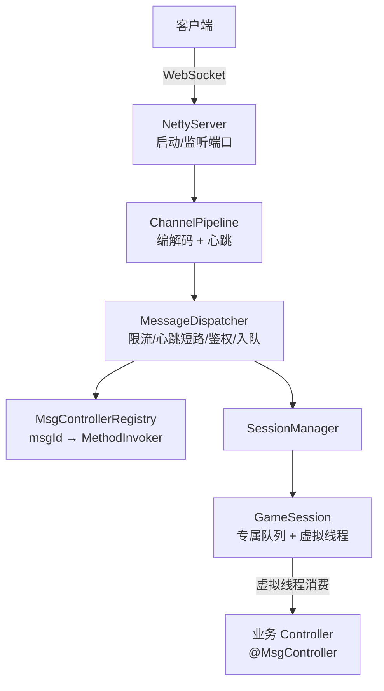
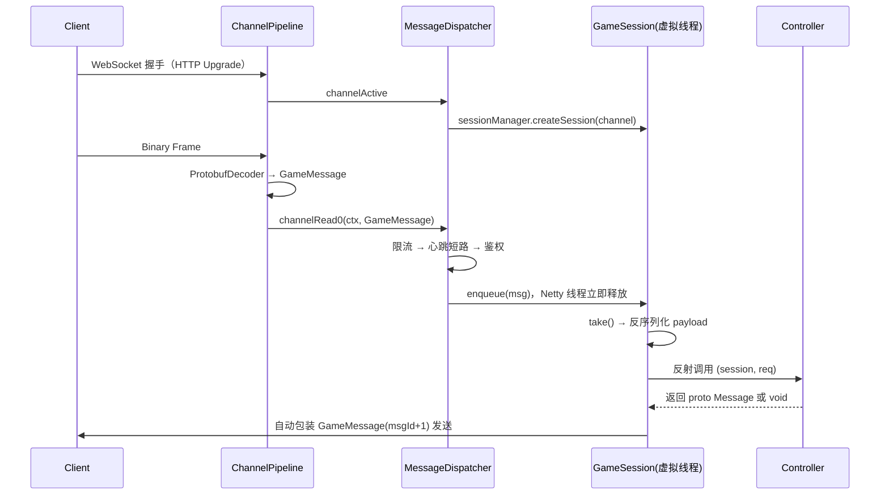

# 框架架构

框架把网络层与业务层彻底分离：Netty I/O 线程只做解码 + 入队，业务在每个用户专属的虚拟线程上串行执行。

## 架构总览



消息统一按用户维度串行：一个 `GameSession` 一条队列、一条虚拟线程。跨用户的共享状态（队伍、公会、排行榜等）由业务侧自行用锁或分布式锁控制，框架不提供分组队列。

## 消息处理主流程



## 核心组件

### NettyServer

Spring `InitializingBean` / `DisposableBean`。Boss 线程组 1 线程接受连接，Worker 线程组 CPU 核数 × 2 处理 I/O。持有 `shuttingDown` 标志，停机时执行优雅停机流程。端口来自 `game.server.port`（默认 8888）。

### GameChannelInitializer

为每条连接装配 Pipeline：

1. Pipeline 最前端的最大连接数检查 —— 在线数 ≥ `game.server.max-connections`（默认 10000）时直接 `ctx.close()`，不发任何响应
2. `HttpServerCodec`
3. `HttpObjectAggregator(65536)` —— 请求体上限 64KB
4. `WebSocketServerProtocolHandler("/ws", null, true)`
5. `ProtobufDecoder(GameMessage)` + `ProtobufEncoder`
6. `IdleStateHandler(60, 0, 0, SECONDS)` —— 读空闲 60s 判定心跳超时
7. `MessageDispatcher`（`@Sharable`）

### MessageDispatcher

`SimpleChannelInboundHandler<GameMessage>`，负责连接生命周期与入队：

```java
protected void channelRead0(ChannelHandlerContext ctx, GameMessage msg) {
    GameSession session = sessionManager.getByChannel(ctx.channel());
    if (session == null) return;
    session.setLastActiveTime(System.currentTimeMillis());

    if (shuttingDown) return;                       // 停机中不再入队

    if (!session.tryAcquireRateLimit()) {            // 限流：静默丢弃
        serverMetrics.messageDropped();
        return;
    }
    serverMetrics.messageReceived();

    int msgId = msg.getMsgId();

    // 心跳短路：不入业务队列，直接在 IO 线程回复
    if (msgId == MsgId.SYSTEM.HEARTBEAT_REQ) {
        C1_HeartbeatReq req = C1_HeartbeatReq.parseFrom(msg.getPayload());
        session.send(/* C2_HeartbeatResp，回填 seq */);
        return;
    }

    // 鉴权基于 @MsgMapping.requireAuth，不硬编码 msgId 范围
    MethodInvoker invoker = msgControllerRegistry.find(msgId);
    if (invoker != null && invoker.requireAuth() && !session.isAuthenticated()) {
        session.send(buildErrorResponse(msg, 401));
        return;
    }
    // 未认证连接探测未知接口同样拦截
    if (invoker == null && !session.isAuthenticated()) {
        session.send(buildErrorResponse(msg, 401));
        return;
    }

    session.enqueue(msg);                            // 用户专属队列，按用户串行
}
```

行为要点：

- 心跳超时（`IdleStateEvent` READER_IDLE）→ 主动关闭 Channel
- 停机中（`shuttingDown = true`）→ 不再入队
- 鉴权失败只回 `error_code=401`，不断开连接
- 心跳解析失败回 `error_code=400`

### MsgControllerRegistry

启动时扫描所有 `@MsgController` Bean 的 `@MsgMapping` 方法，构建 `msgId → MethodInvoker` 映射：

```java
public record MethodInvoker(
    Object bean,
    Method method,
    Class<? extends Message> payloadType,
    boolean requireAuth      // 来自 @MsgMapping.requireAuth()
) {}
```

Fail-Fast 校验（任一不满足则启动抛 `IllegalStateException`）：

- 方法参数必须是 `(GameSession, ? extends com.google.protobuf.Message)`
- msgId 不得重复注册
- `@MsgMapping` 的 value 必须与第二个参数类名前缀 `C{msgId}_` 推导的 msgId 一致

`find(msgId)` 未注册时返回 `null`。

### GameSession

单连接状态 + 专属队列 + 专属虚拟线程 + 令牌桶：

| 字段 | 类型 | 说明 |
|---|---|---|
| sessionId | String | UUID |
| channel | Channel | Netty Channel |
| userId | long | 登录后绑定，0 = 未登录 |
| authenticated | boolean | 是否已认证 |
| createTime / lastActiveTime | long | 时间戳 |
| messageQueue | `LinkedBlockingQueue<GameMessage>` | 有界，容量 256，满时丢弃新消息 |
| consumerThread | Thread | `Thread.ofVirtual()`，创建时启动 |
| acceptingMessages | volatile boolean | 停机时置 false，`enqueue()` 静默丢弃 |
| rateLimiter | Guava RateLimiter | 默认 30 req/s，`tryAcquire()` 非阻塞 |

消费循环（虚拟线程）：

```java
while (!Thread.currentThread().isInterrupted()) {
    GameMessage msg = messageQueue.take();          // 虚拟线程挂起，不占平台线程
    if (msg == POISON_PILL) break;                  // 毒丸退出

    MethodInvoker invoker = msgControllerRegistry.find(msg.getMsgId());
    if (invoker == null) { send(error(msg, 404)); continue; }

    Message payload = invoker.payloadType().parseFrom(msg.getPayload());
    Object result = invoker.method().invoke(invoker.bean(), this, payload);

    if (result instanceof Message resp) {           // 自动包装响应
        send(GameMessage.newBuilder()
             .setMsgId(msg.getMsgId() + 1)
             .setSeq(msg.getSeq())
             .setPayload(resp.toByteString())
             .build());
    }
    // 返回 void / null：业务自行 session.send()
}
```

保证：同一用户消息严格按入队顺序执行；单条消息异常只记日志，不中断消费线程；Session 销毁后虚拟线程必定退出。

### SessionManager

`ConcurrentHashMap` 管理全部在线 Session，支持按 Channel、按 userId 查找，提供准确的 `onlineCount()`，并在创建 Session 时注入限流速率。

### 跨用户共享状态

框架只提供按用户串行，不提供队伍/公会等分组队列（早期的 `SharedQueueManager` / `DistributedQueueManager` / `GroupType` 已移除）。涉及多个用户共享数据的逻辑由业务侧显式加锁：

- 单进程：对共享对象加锁（`synchronized`、`ReentrantLock`）或使用并发容器的原子操作
- 多进程：业务侧自行引入分布式锁

这样框架路径只有一条，行为可预测；代价是跨用户一致性需要业务显式处理。

### ServerMetrics

`AtomicLong` 追踪 onlineConnections / totalConnections / messagesReceived / messagesDropped，`@Scheduled(fixedDelay = 60_000)` 以 INFO 打印一行指标摘要。后续可扩展接入 Prometheus。

## 限流与连接保护

- 每 Session 一个 Guava 令牌桶，默认 30 req/s（`game.server.rate-limit.per-second`）
- 超限消息**静默丢弃**，不回错误响应（避免放大攻击），`messagesDropped` 递增并记 WARN
- 在线连接数上限默认 10000（`game.server.max-connections`），Pipeline 最前端拦截

## 优雅停机

```
1. shuttingDown ← true，MessageDispatcher.setShuttingDown(true)（停止入队）
2. 所有 Session: stopAcceptingMessages()
3. 所有 Session: 投毒丸 + awaitConsumerTermination(30s)
4. 关闭 serverChannel
5. 关闭 Boss/Worker EventLoopGroup，Spring Context 销毁
```

入口有两处：Spring `DisposableBean.destroy()` 与 `NettyServer` 注册的 JVM ShutdownHook，二者由 `shuttingDown` 标志保证只执行一次。

超时（30s）后强制关闭剩余连接，不再等待队列清空。

## 错误处理

| 场景 | 处理方式 |
|---|---|
| msgId 未注册 | 返回 `error_code=404` |
| 未认证访问受保护消息 | 返回 `error_code=401`，不断开连接 |
| payload 反序列化失败 | 捕获 `InvalidProtocolBufferException`，返回 `error_code=400` 并记日志 |
| Controller 抛异常 | 返回 `error_code=500` 并记日志，消费线程继续 |
| 心跳超时（60s 无读事件） | 主动关闭 Channel |
| Protobuf 解码失败 | `exceptionCaught` 关闭连接 |
| 消息体 > 64KB | 聚合器拒绝，关闭连接 |
| 用户队列积压 > 256 | 丢弃新消息 + WARN + `messagesDropped++`，不断开连接 |
| 心跳消息解析失败 | 返回 `error_code=400` 并记 WARN |
| 连接数超限 | 直接关闭新连接，不发响应 + WARN |
| 限流超限 | 静默丢弃 + WARN + `messagesDropped++` |
| 停机期间新消息 | `enqueue()` 静默丢弃 |

## 性能取舍

- Netty I/O 线程零业务逻辑，只解码 + 入队
- 虚拟线程创建/销毁成本极低，`take()` 阻塞时不占平台线程，可支撑数万并发会话
- 单用户串行天然免锁，无需额外同步
- 只有一条分发路径（用户队列），没有分组队列的创建/回收与降级开销；代价是跨用户一致性交给业务
- 心跳在 IO 线程短路回复，不占用业务队列
- Protobuf 相比 JSON 更适合高频小包

## 安全取舍

- 消息体大小限制 64KB
- 细粒度鉴权由 `@MsgMapping.requireAuth` 声明，默认需要登录
- 最大连接数、令牌桶限流、心跳超时断开三层资源保护
- Token 校验逻辑在业务 Controller/Service 内实现，框架不感知认证方式

> 框架级正确性属性见 [properties.md](properties.md)，EARS 验收标准见 [requirements/framework.md](requirements/framework.md)。
